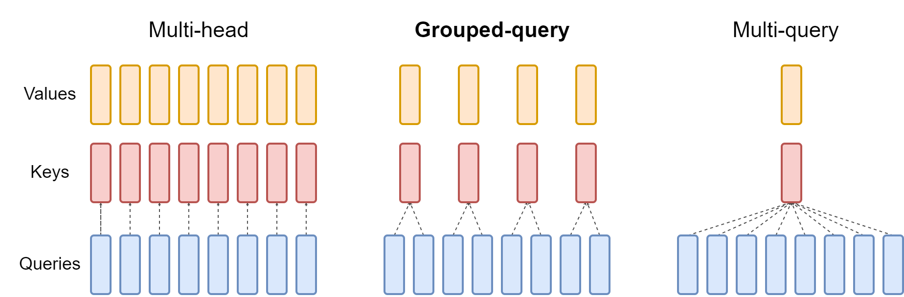
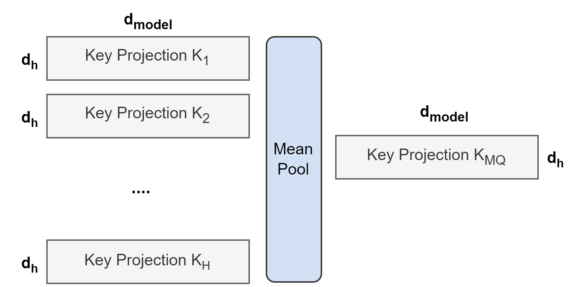
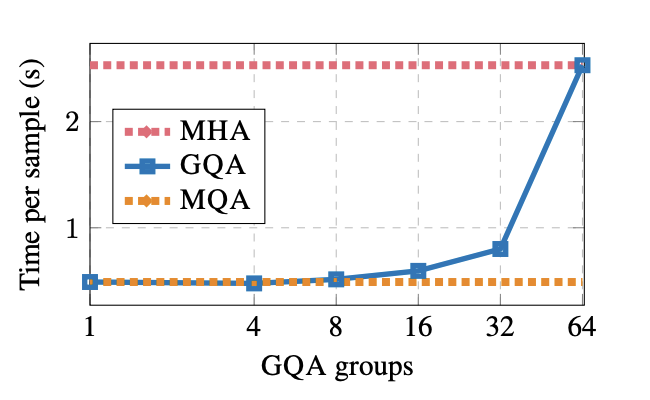
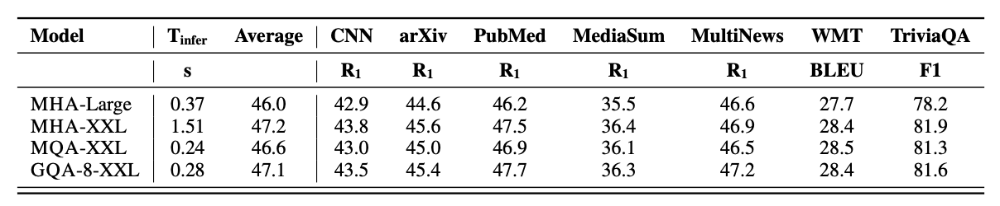
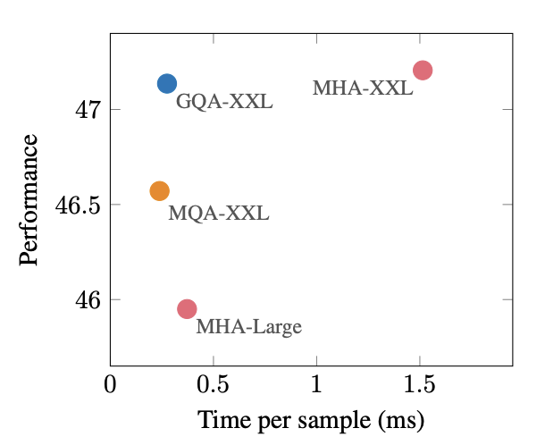

# GQA: Training Generalized Multi-Query Transformer Models from Multi-Head Checkpoints
## Grouped-Query Attention for Efficient Transformer Inference

**Paper:** GQA: Training Generalized Multi-Query Transformer Models from Multi-Head Checkpoints  
**Authors:** Joshua Ainslie, James Lee-Thorp, Michiel de Jong, Yury Zemlyanskiy, Federico Lebrón, Sumit Sanghai (Google Research)  
**Conference:** EMNLP 2023  
**ArXiv:** https://arxiv.org/abs/2305.13245

**Presented by:** Shivam Tyagi
**Date:** Tuesday, October 22, 2025

---

## Overview: The Inference Bottleneck Problem

### The Context

Have you ever been typing a prompt to an AI, waiting for it to finish its sentence, and you're just thinking: *what is taking so long?* That little pause, that delay, it's actually one of the biggest challenges in AI right now. These models are running on some of the most powerful computers on the planet, so what's the holdup?

The answer isn't about raw computing power. It's actually something more like a massive **traffic jam** happening inside the model's memory.

---

## Question 1: Understanding the Bottleneck

### Primary Question

**What is the primary bottleneck for Transformer models during autoregressive decoder inference?**

Click to reveal answer

The **memory bandwidth overhead** from loading all attention keys and values at every decoding step.

It's not the compute (GPU calculations) that's slow, it's the constant loading of the KV cache from memory to compute attention for each new token.

---

### The Problem Statement

When an AI is generating text, that whole process is called **inference**. The biggest cause of the delay is something called **memory bandwidth**. For every single word the AI generates, it has to load a ton of data from memory, specifically, something called **attention keys and values**.

Imagine having to reread an entire library of reference books just to write the very next word in your sentence. It's that constant fetching of data that slows the whole thing down.

**Autoregressive decoder inference** presents a significant bottleneck for Transformer models due to:
- **Memory bandwidth overhead** from loading attention keys and values (KV cache)
- At **every single decoding step**, all attention KVs must be loaded from memory
- This is the primary constraint limiting inference speed

### Existing Solutions and Their Trade-offs

To understand the fix, we first have to understand how these models pay attention. Here's a helpful way to think about it:

**At every decoding step, all attention heads work in parallel analyzing the input, but before they can start, they all need their reference materials (key-value pairs) loaded from memory at the same time.**

Think of a library storage room with a narrow doorway. Multiple librarians need to retrieve different reference documents simultaneously, but they all must pass through that same narrow doorway. The doorway represents memory bandwidth - it limits how much data can flow through at once, creating congestion when many try to access it simultaneously.

**Multi-Head Attention (MHA)** - The Original
- **H librarians** all trying to squeeze through the doorway at once with their materials
- Each query head needs its own unique set of K/V reference materials
- High quality, diverse perspectives on the input
- But **too much congestion** at the doorway = **slow inference** due to memory bandwidth bottleneck

**Multi-Query Attention (MQA)** - The Speed Solution
- **Only 1 librarian** passes through the doorway
- All query heads share one single set of K/V materials
- **No congestion**, blazing fast inference with minimal memory bandwidth
- But everyone works from the same limited references, so **quality suffers**
- Can cause **training instability**

As you can see in the diagram above:
- **Left**: MHA has 8 separate K/V heads (8 librarians, heavy congestion, slow, high quality)
- **Right**: MQA has 1 shared K/V head (1 librarian, no congestion, fast, quality loss)
- **Middle**: GQA finds the sweet spot

**The bottleneck isn't how fast the attention heads compute (parallel GPU work), it's the congestion at the memory bandwidth "doorway" when all heads need their K/V data simultaneously.**

### The GQA Approach

**Grouped-Query Attention (GQA)** is the genius solution in the middle. 

Instead of H librarians crowding the doorway (MHA) or just 1 librarian (MQA), we have **G librarians** passing through (where 1 < G < H), each carrying materials for a small group of query heads to share.

It's the perfect compromise:
- Maintains quality by having **G different sets of K/V materials** (not just 1 like MQA)
- Achieves speed by having **less congestion than MHA** (only G librarians instead of H)
- **Memory bandwidth:** Only G sets of data need to flow through simultaneously
- **Computation:** All H query heads still work in parallel
- **Interpolates between MHA and MQA**

Less congestion than MHA (faster), but more diverse materials than MQA (better quality).

### How the Problem Was Addressed

The brilliant insight: we don't need to train a new model from scratch. We can convert existing high-quality MHA models through a **two-step uptraining process**:

#### Step 1: Checkpoint Conversion via Mean Pooling

Rather than firing all but a few librarians and losing their knowledge, we create **"super librarians"** by merging the expertise of multiple librarians together.

**Mean pooling** works by:
- Taking all H original key projection heads from MHA
- Averaging their parameters to create fewer (G) shared key heads
- Same process for value heads
- Preserves maximum information from the pre-trained model

Think of it as: Instead of having H different librarians with specialized knowledge, we merge their expertise into G "super librarians" who each possess the combined knowledge of multiple specialists. This reduces congestion at the doorway while retaining diverse knowledge.

This works **way better** than:
- Just picking one librarian randomly (loses specialized knowledge from others)
- Starting from scratch with random initialization (loses all learned knowledge)

---
## Question 2: Understanding the GQA Trade-offs
### Part A: The Uptraining Efficiency

**We can convert an existing MHA model to GQA using mean pooling. But then the model needs additional training to adapt to its new structure.**

**How much additional training time do you think is required? What percentage of the original pre-training compute?**

*Consider: The model has already learned everything during MHA pre-training. It just needs to adjust to the new attention structure.*

Click to reveal answer

Only **5% of the original training time!**

This is shockingly efficient. If the original model took months to train, uptraining takes just days. The model retains all its learned knowledge, it only needs a brief adjustment period to work with the new grouped K/V heads.

**Why this matters:**
- Converting existing models is economically viable
- Don't need to retrain from scratch (which would cost 100%)
- Can upgrade deployed models to be 5x faster at minimal cost
- Makes GQA practical for real-world deployment

---

#### Step 2: Uptraining (Only 5%!)

After conversion, the model needs a brief adjustment period, like a patient waking up from surgery. It has all the same knowledge but needs time to adapt to its new setup.

How long? **Only 5% of the original training time!**

This short period of extra training gives the model enough time to learn how to work with its new, streamlined attention setup. Because it's only 5% of the original compute cost, it is an unbelievably efficient way to get a much faster model.

We're not rebuilding the whole car here, we're just giving the engine a quick tune-up.

---

## Question 2: Understanding the GQA Trade-offs

### Part B: The Speed-Quality Trade-off

**Looking at the graph above, what happens to inference speed as we increase the number of GQA groups?**

*Think about the continuum from MQA (1 group) to MHA (64 groups for this model).*

Click to reveal answer

As the number of groups **increases**, inference time **increases** (slower), approaching MHA performance.

- **G = 1** (MQA): Fastest, but quality suffers
- **G = 8** (GQA-8): **Sweet spot** with near-MQA speed and near-MHA quality
- **G = 64** (MHA): Slowest, highest quality

The graph shows that GQA-8 achieves the optimal balance, staying close to MQA's speed (orange line) while avoiding the sharp increase in latency that comes with more groups.

---

## Architecture Overview: Formal Algorithms

### Algorithm 1: Multi-Head Attention (MHA)

**Input:** $X \in \mathbb{R}^{\ell \times d_{\text{model}}}$, number of heads $H$, dimensions $d_k$, $d_v$

**Parameters:** 
- Query weights: $W_q^h \in \mathbb{R}^{d_{\text{model}} \times d_k}$ for $h \in [H]$
- Key weights: $W_k^h \in \mathbb{R}^{d_{\text{model}} \times d_k}$ for $h \in [H]$
- Value weights: $W_v^h \in \mathbb{R}^{d_{\text{model}} \times d_v}$ for $h \in [H]$
- Output weight: $W_o \in \mathbb{R}^{H \cdot d_v \times d_{\text{model}}}$

**Algorithm:**

1. **for** $h = 1, \ldots, H$ **do**
2. $\quad Q_h \leftarrow X W_q^h$ $\triangleright$ Query projection for head $h$
3. $\quad K_h \leftarrow X W_k^h$ $\triangleright$ Key projection for head $h$
4. $\quad V_h \leftarrow X W_v^h$ $\triangleright$ Value projection for head $h$
5. $\quad \text{scores}_h \leftarrow (Q_h K_h^T) / \sqrt{d_k}$ $\triangleright$ Scaled dot-product attention
6. $\quad \text{attn}_h \leftarrow \text{softmax}(\text{scores}_h)$ $\triangleright$ Attention weights
7. $\quad \text{head}_h \leftarrow \text{attn}_h V_h$ $\triangleright$ Weighted values
8. **end for**
9. $\text{output} \leftarrow W_o [\text{head}_1; \text{head}_2; \ldots; \text{head}_H]$ $\triangleright$ Concatenate and project
10. **return** $\text{output}$

**Memory Complexity:** $O(H \cdot d_{\text{model}} \cdot d_k)$ for KV cache

### Algorithm 2: Multi-Query Attention (MQA)

**Input:** $X \in \mathbb{R}^{\ell \times d_{\text{model}}}$, number of heads $H$, dimensions $d_k$, $d_v$

**Parameters:**
- Query weights: $W_q^h \in \mathbb{R}^{d_{\text{model}} \times d_k}$ for $h \in [H]$
- **Shared** key weight: $W_k \in \mathbb{R}^{d_{\text{model}} \times d_k}$ (single)
- **Shared** value weight: $W_v \in \mathbb{R}^{d_{\text{model}} \times d_v}$ (single)
- Output weight: $W_o \in \mathbb{R}^{H \cdot d_v \times d_{\text{model}}}$

**Algorithm:**

1. $K \leftarrow X W_k$ $\triangleright$ Single shared key projection
2. $V \leftarrow X W_v$ $\triangleright$ Single shared value projection
3. **for** $h = 1, \ldots, H$ **do**
4. $\quad Q_h \leftarrow X W_q^h$ $\triangleright$ Query projection for head $h$
5. $\quad \text{scores}_h \leftarrow (Q_h K^T) / \sqrt{d_k}$ $\triangleright$ All heads share same $K$
6. $\quad \text{attn}_h \leftarrow \text{softmax}(\text{scores}_h)$ $\triangleright$ Attention weights
7. $\quad \text{head}_h \leftarrow \text{attn}_h V$ $\triangleright$ All heads share same $V$
8. **end for**
9. $\text{output} \leftarrow W_o [\text{head}_1; \text{head}_2; \ldots; \text{head}_H]$ $\triangleright$ Concatenate and project
10. **return** $\text{output}$

**Memory Complexity:** $O(d_{\text{model}} \cdot d_k)$ for KV cache ✓ **Much smaller!**

**Trade-off:** Significant speedup but quality degradation and training instability

### Algorithm 3: Grouped-Query Attention (GQA)

**Input:** $X \in \mathbb{R}^{\ell \times d_{\text{model}}}$, number of heads $H$, number of groups $G$ (where $G < H$), dimensions $d_k$, $d_v$

**Parameters:**
- Query weights: $W_q^h \in \mathbb{R}^{d_{\text{model}} \times d_k}$ for $h \in [H]$
- Key weights: $W_k^g \in \mathbb{R}^{d_{\text{model}} \times d_k}$ for $g \in [G]$ (G shared heads)
- Value weights: $W_v^g \in \mathbb{R}^{d_{\text{model}} \times d_v}$ for $g \in [G]$ (G shared heads)
- Output weight: $W_o \in \mathbb{R}^{H \cdot d_v \times d_{\text{model}}}$

**Algorithm:**

1. $\text{queries per group} \leftarrow H / G$
2. **for** $g = 1, \ldots, G$ **do**
3. $\quad K_g \leftarrow X W_k^g$ $\triangleright$ Key projection for group $g$
4. $\quad V_g \leftarrow X W_v^g$ $\triangleright$ Value projection for group $g$
5. **end for**
6. **for** $h = 1, \ldots, H$ **do**
7. $\quad Q_h \leftarrow X W_q^h$ $\triangleright$ Query projection for head $h$
8. $\quad g \leftarrow \lfloor h / \text{queries per group} \rfloor$ $\triangleright$ Determine which group
9. $\quad \text{scores}_h \leftarrow (Q_h K_g^T) / \sqrt{d_k}$ $\triangleright$ Use group's shared $K$
10. $\quad \text{attn}_h \leftarrow \text{softmax}(\text{scores}_h)$ $\triangleright$ Attention weights
11. $\quad \text{head}_h \leftarrow \text{attn}_h V_g$ $\triangleright$ Use group's shared $V$
12. **end for**
13. $\text{output} \leftarrow W_o [\text{head}_1; \text{head}_2; \ldots; \text{head}_H]$ $\triangleright$ Concatenate and project
14. **return** $\text{output}$

**Memory Complexity:** $O(G \cdot d_{\text{model}} \cdot d_k)$ for KV cache

**Key Property:** 
- When $G = H$: equivalent to MHA (slow, high quality)
- When $G = 1$: equivalent to MQA (fast, lower quality)
- When $G = 8$ (typical): **optimal trade-off!**

### Algorithm 4: Checkpoint Conversion via Mean Pooling

**Input:** Pre-trained MHA model with $H$ heads, target number of groups $G$

**Conversion Process:**

**Given:** MHA parameters $W_k^1, W_k^2, \ldots, W_k^H$ and $W_v^1, W_v^2, \ldots, W_v^H$

1. $\text{queries per group} \leftarrow H / G$
2. **for** $g = 1, \ldots, G$ **do**
3. $\quad \text{start\_idx} \leftarrow g \times \text{queries per group}$
4. $\quad \text{end\_idx} \leftarrow \text{start\_idx} + \text{queries per group}$
5. $\quad W_k^g \leftarrow \frac{1}{\text{queries per group}} \times \sum_{i=\text{start\_idx}}^{\text{end\_idx}-1} W_k^i$ $\triangleright$ Mean pool key matrices
6. $\quad W_v^g \leftarrow \frac{1}{\text{queries per group}} \times \sum_{i=\text{start\_idx}}^{\text{end\_idx}-1} W_v^i$ $\triangleright$ Mean pool value matrices
7. **end for**
8. **return** GQA model with $G$ key/value heads

**Why Mean Pooling Works Best:**
- Preserves maximum information from pre-trained checkpoint
- Better than selecting first head (loses information)
- Better than random initialization (loses all learned knowledge)

### Algorithm 5: Uptraining Procedure

**Input:** Converted GQA model from Algorithm 4, original training data, original training steps $N_{\text{steps}}$

**Uptraining:**

1. $\text{uptrain steps} \leftarrow 0.05 \times N_{\text{steps}}$ $\triangleright$ Only 5% of original!
2. $\text{model}_{\text{GQA}} \leftarrow$ converted model from mean pooling
3. **for** $\text{step} = 1$ **to** $\text{uptrain steps}$ **do**
4. $\quad \text{batch} \leftarrow \text{sample}(\text{training data})$
5. $\quad \text{loss} \leftarrow \text{compute loss}(\text{model}_{\text{GQA}}, \text{batch})$
6. $\quad \text{model}_{\text{GQA}} \leftarrow \text{update parameters}(\text{model}_{\text{GQA}}, \text{loss})$ $\triangleright$ Standard gradient descent
7. **end for**
8. **return** Uptrained GQA model

**Key Insight:** Brief uptraining (5%) allows model to adapt to new attention structure while retaining knowledge from original MHA checkpoint.

### Key Differences from Previous Models

| Aspect | MHA | MQA | GQA |
|--------|-----|-----|-----|
| KV heads per model | H | 1 | G (1 < G < H) |
| KV cache size | Largest | Smallest | Medium |
| Inference speed | Slowest | Fastest | Near-MQA speed |
| Quality | Highest | Lower | Near-MHA quality |
| Training stability | Stable | Can be unstable | Stable |
| Conversion cost | N/A | High if from scratch | 5% with uptraining |

---

## Experimental Results: The Payoff

### T5-XXL Model Performance

### Key Findings

The payoff is absolutely fantastic. Looking at the results:

**Model Comparison:**

| Model | Inference Time (T_infer) | Average Performance | Speed Improvement | Quality Loss |
|-------|-------------------------|---------------------|-------------------|--------------|
| **MHA-XXL** | 1.51 s | 47.2 | Baseline | Baseline |
| **MQA-XXL** | 0.24 s | 46.6 | **6.3x faster** | -0.6 points |
| **GQA-8-XXL** | 0.28 s | 47.1 | **5.4x faster** | -0.1 points |

**The GQA Sweet Spot:**
- Achieves **near-MQA speed** (0.28s vs 0.24s)
- Maintains **near-MHA quality** (47.1 vs 47.2)
- Massive win-win: 5.4x speedup with only 0.1-point quality loss!

### Benchmark Performance Details

From the detailed results table:
- **CNN, arXiv, PubMed, MediaSum, MultiNews** (summarization tasks): GQA-8 performs nearly identically to MHA-XXL
- **WMT** (translation, measured in BLEU): 28.4 for both GQA-8 and MHA-XXL
- **TriviaQA** (question answering, F1): 81.6 vs 81.9, minimal difference

### Ablation Study: Checkpoint Conversion Methods

The research compared three methods for converting MHA to multi-query structure:

**Ranked by Performance:**
1. **Mean Pooling** (Best)
   - Averages projection matrices of all H original heads
   - Preserves maximum information from pre-trained checkpoint
   - Used in GQA conversion

2. **First Head Selection** (Second)
   - Uses projection matrices from only the first head
   - Simple but loses information from other heads

3. **Random Initialization** (Worst)
   - Initializes new key/value matrices from scratch
   - Loses all learned knowledge from pre-training

**Key Takeaway:** The degree to which information is preserved from the pre-trained model correlates directly with performance.

---

## Critical Analysis

### What the Authors Accomplished Well

1. **Elegant interpolation between extremes**
   - GQA provides a tunable parameter (G) to balance speed vs. quality
   - Proves the trade-off isn't binary (MHA vs MQA)

2. **Efficient uptraining approach**
   - Only 5% of original compute required
   - Makes conversion economically viable for large models
   - Can leverage existing high-quality checkpoints

3. **Strong empirical validation**
   - Comprehensive evaluation on T5-XXL (11B parameters)
   - Multiple benchmark tasks showing consistency
   - Clear ablation study on conversion methods

4. **Practical impact**
   - Immediately applicable to deployed models
   - Reduces infrastructure costs significantly
   - Improves user experience with faster responses

### What Was Overlooked or Could Be Developed Further

#### 1. Limited Model Architecture Coverage

**Issue:** Experiments focused exclusively on T5 (encoder-decoder architecture)

**Missing:**
- **Decoder-only models** (GPT-style): These are now the dominant architecture for large language models (Llama, GPT-4, Claude, etc.)
- **Encoder-only models** (BERT-style): Still widely used for classification and embedding tasks
- Does GQA provide the same benefits across all Transformer variants?

**Why it matters:** The inference bottleneck is arguably even more critical for decoder-only models used in chat applications.

#### 2. Optimal Group Size Selection

**Issue:** Paper uses GQA-8 but doesn't deeply explore how to choose G

**Unanswered questions:**
- Is G=8 optimal for all model sizes, or should it scale?
- Should G be determined by model size, hardware constraints, or application requirements?
- What's the formula or heuristic for choosing G?
- Could G be learned during training rather than fixed?

**Why it matters:** Practitioners need guidance on this hyperparameter for their specific use cases.

#### 3. Training Instability of MQA Not Deeply Analyzed

**Issue:** Paper mentions MQA can cause training instability but doesn't investigate why

**Missing analysis:**
- What causes the instability? Gradient issues? Optimization challenges?
- Does GQA show more stable training curves during uptraining?
- Are there training techniques that could stabilize MQA and eliminate the need for GQA?

**Why it matters:** Understanding root causes could lead to even better solutions.

#### 4. Long Context Performance

**Issue:** Experiments use "standard" sequence lengths for 2023

**Missing:**
- Modern LLMs use 32K, 100K, even 1M+ token contexts
- Does GQA maintain its advantages at extreme lengths?
- Memory bandwidth could be even more critical with longer contexts
- Does the optimal G change with sequence length?

**Why it matters:** The trend is clearly toward longer context windows; GQA should be evaluated in this regime.

#### 5. Interaction with Other Optimizations

**Issue:** GQA evaluated in isolation

**Unexplored combinations:**
- **FlashAttention**: Different memory optimization technique, do they compose well?
- **Quantization**: INT8 or INT4 weights could further reduce memory bandwidth
- **Speculative decoding**: Multiple token prediction, how does it interact?
- **Sparse attention patterns**: Could combining reduce memory even further?

**Why it matters:** Real deployments use multiple optimizations; understanding interactions is crucial.

### Potential Errors or Limitations

1. **Limited uptraining exploration**
   - Is 5% sufficient for all model sizes and domains?
   - Larger models might need more; smaller might need less
   - No analysis of the quality-vs-uptraining-time curve

2. **No analysis of failure cases**
   - When does GQA *not* work well?
   - Are there specific task types or data distributions where MHA is necessary?

3. **Single domain focus**
   - Primarily evaluated on natural language tasks
   - What about code generation? Multi-modal tasks?

### How the Work Has Held Up

**Adoption in Industry (2023-2025):**
- **Llama 2** (Meta): Uses GQA in 70B parameter model
- **Mistral 7B**: Deployed with GQA for efficiency
- **Many open-source models** now default to GQA
- **Serving frameworks** (vLLM, TGI) have specialized GQA optimizations

**No Major Disputes:**
- Findings replicated across multiple model families
- Speed-quality trade-off confirmed
- Mean pooling widely accepted as best conversion method

**Proven at Scale:**
- Works for models from 7B to 70B+ parameters
- Deployed in production systems serving millions
- Performance benefits hold in real-world settings

**Extended by Others:**
- Research on dynamic/learned group assignments
- Combination with FlashAttention and other techniques
- Application to multi-modal models

**Overall Assessment:** The work has been highly influential and its core findings remain valid. It successfully changed the conversation from "MHA vs MQA" to "how to optimally interpolate between them."

---

## Impact: Changing the AI Landscape

### Immediate Impact (2023)

#### Made Existing Models Practical

Before GQA, organizations faced a difficult choice:
- Train new models with MQA from scratch (expensive, risky, quality issues)
- Deploy MHA models (expensive inference, poor user experience)

GQA provided a third option:
- **Convert existing high-quality MHA models cheaply** (5% of training cost)
- **Deploy with 5-7x speedup** and minimal quality loss
- **Leverage existing investments** in pre-trained models

#### Democratization of AI

**Reduced inference costs:**
- Smaller KV cache → less memory bandwidth → cheaper hardware
- 5x speedup → serve 5x more users with same infrastructure
- Made large model deployment accessible to smaller organizations

**Better user experience:**
- Faster responses in chat applications
- Reduced latency for real-time applications
- More responsive AI assistants

**Broader accessibility:**
- Models that previously required datacenter GPUs can run on smaller hardware
- Enabled edge deployment scenarios
- Reduced carbon footprint of AI inference

### Industry Adoption and Infrastructure Impact

#### Models Using GQA

**Major deployments:**
- **Llama 2** (Meta, July 2023): 70B model uses GQA
  - One of the most widely deployed open LLMs
  - Proved GQA works at massive scale
- **Mistral 7B** (September 2023): GQA for efficiency
  - Outperforms larger models partly due to efficient architecture
- **Countless open-source models** now default to GQA
  - Yi, Qwen, DeepSeek, and many others
  - GQA considered "best practice" for new models

#### Infrastructure Changes

**Cloud providers:**
- AWS, GCP, Azure optimize their LLM serving for GQA
- Pricing models account for GQA efficiency
- Specialized instances for GQA workloads

**Hardware vendors:**
- NVIDIA, AMD, and others consider GQA in chip design
- Memory hierarchy optimizations for grouped attention
- Future hardware may have GQA-specific acceleration

**Serving frameworks:**
- **vLLM**: Highly optimized GQA kernels
- **Text Generation Inference (TGI)**: GQA-aware memory management
- **TensorRT-LLM**: Specialized GQA operators
- **llama.cpp**: Efficient GQA for CPU inference

### Connections to Past Work

#### Built Upon

1. **"Attention Is All You Need"** (Vaswani et al., 2017)
   - Original Transformer with multi-head attention
   - Established the architecture GQA optimizes

2. **"Fast Transformer Decoding: One Write-Head is All You Need"** (Shazeer, 2019)
   - Introduced Multi-Query Attention
   - Identified the inference bottleneck problem
   - GQA builds directly on this insight

3. **"Exploring the Limits of Transfer Learning with a Unified Text-to-Text Transformer"** (Raffel et al., 2020)
   - T5 model family used for GQA experiments
   - Provided strong MHA baselines

4. **Memory efficiency research**
   - FlashAttention (Dao et al., 2022)
   - Parallel investigations into attention optimization
   - Complementary approaches to reducing memory bottlenecks

### Connections to Present Work (2024-2025)

#### Research Extending GQA

1. **Dynamic Grouping**
   - Adjust G during inference based on input complexity
   - Use more groups (higher quality) for important queries
   - Use fewer groups (higher speed) for simple queries

2. **Learned Grouping**
   - Train model to determine optimal query-to-group assignments
   - Let the model decide which queries should share KV heads
   - Potentially better than fixed grouping

3. **Hybrid Approaches**
   - Combine GQA with FlashAttention for even greater speedups
   - Mix GQA with sparse attention patterns
   - Layer-wise variation in group count

4. **Multi-Modal Models**
   - Apply GQA to vision-language models (LLaVA, GPT-4V style)
   - Different grouping for vision vs. text tokens
   - Cross-modal attention with GQA

5. **Extreme Long Context**
   - Investigating GQA behavior at 100K+ token contexts
   - Adaptive grouping based on sequence length
   - Memory-optimal configurations for long contexts

### Future Implications

#### Shift in AI Development Philosophy

GQA represents a broader trend in AI research:

**From "Bigger is Better" to "Smarter Engineering"**
- For years, progress meant larger models (GPT-2 → GPT-3 → GPT-4)
- GQA showed that architectural improvements can deliver bigger wins
- Efficiency is now a first-class concern, not an afterthought

**Value of Post-Training Conversion**
- Don't always need to train from scratch
- Can upgrade existing models cost-effectively
- "Uptraining" as a paradigm for model improvement

**Deployment-Aware Design**
- Architecture decisions driven by inference constraints
- Training efficiency ≠ inference efficiency
- Need to optimize for the deployment environment

#### Open Questions for the Future

1. **Can we apply similar "interpolation" strategies to other components?**
   - Feedforward layers (largest parameters)?
   - Embedding layers?
   - What other architecture bottlenecks can be addressed post-training?

2. **How far can we push efficiency without retraining?**
   - Quantization + GQA + FlashAttention + ...?
   - What's the theoretical limit?
   - Will we hit quality walls?

3. **Will future models be designed with GQA from the start?**
   - Or train MHA first for quality, then convert?
   - What's the optimal training strategy?

4. **How does GQA interact with new attention mechanisms?**
   - Sliding window attention (Mistral-style)?
   - Ring attention for distributed inference?
   - Mixture of experts (MoE) architectures?

### The Real Impact

> **GQA proved that clever engineering can deliver bigger wins than simply throwing more compute at problems.**

By making powerful AI **faster** (5-7x speedup), **cheaper** (smaller infrastructure), and **more accessible** (easier deployment), GQA helped move AI from research labs to real-world applications that benefit everyone.

The paper's core insight, that we don't have to choose between two extremes but can intelligently interpolate, has influenced thinking far beyond attention mechanisms. It's a reminder that in a field often dominated by "bigger = better," sometimes the smartest solution is finding the right balance.

---

## Resource Links

1. **Original Paper**: [GQA: Training Generalized Multi-Query Transformer Models from Multi-Head Checkpoints](https://arxiv.org/abs/2305.13245) - Ainslie et al., EMNLP 2023

2. **Hugging Face Implementation**: [Transformers Library GQA Support](https://huggingface.co/docs/transformers/main/en/attention#grouped-query-attention-gqa) - Official implementation and usage guide

3. **Llama 2 Paper**: [Llama 2: Open Foundation and Fine-Tuned Chat Models](https://arxiv.org/abs/2307.09288) - Meta's deployment of GQA at scale (70B parameters)

4. **Multi-Query Attention (Predecessor)**: [Fast Transformer Decoding: One Write-Head is All You Need](https://arxiv.org/abs/1911.02150) - Shazeer, 2019

5. **vLLM Documentation**: [vLLM: Easy, Fast, and Cheap LLM Serving with PagedAttention](https://github.com/vllm-project/vllm) - Production serving framework with GQA optimizations

6. **Original Transformer Paper**: [Attention Is All You Need](https://arxiv.org/abs/1706.03762) - Vaswani et al., 2017 - Foundation for all modern attention mechanisms

---

*This presentation demonstrates how clever engineering and efficient model conversion can make powerful AI systems more practical, accessible, and cost-effective for real-world deployment.*

